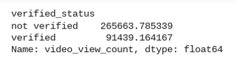
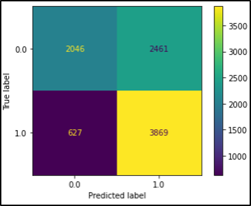
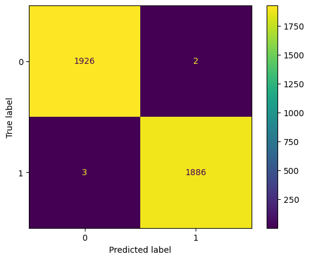

**<h1 style="text-align: left;"></h1>**
**<h1 style="text-align: center;"> TikTok Project</h1>**

## Contents
- [Contents](#contents)
- [Background](#background)
- [Hypothesis Testing](#hypothesis-testing)
    - [*Overview*](#overview)
    - [*Details*](#details)
    - [*Key Insights*](#key-insights)
    - [*Next Steps*](#next-steps)
- [Account Status Prediction](#account-status-prediction)
    - [*Overview*](#overview-1)
    - [*Project Status*](#project-status)
    - [*Key Insights*](#key-insights-1)
    - [*Next steps*](#next-steps-1)
- [Classification](#classification)
    - [*Overview*](#overview-2)
    - [*Problem*](#problem)
    - [*Solution*](#solution)
    - [*Details*](#details-1)
    - [*Next Steps*](#next-steps-2)
- [Author](#author)
## Background
This project is part of the Google Advanced Data Analytics(GADA) professional certificate program. In this program created scenario I am working for the video creation platform Tiktok. The TikTok team wants to predict and label weather each video is an opinion or a claim.The task at hand involves classifying TikTok videos into two categories: "Claim" and "Opinion." A successful machine learning model will be capable of automatically identifying whether a given video makes a factual claim or merely expresses an opinion. This distinction is crucial for TikTok's content moderation efforts and can significantly enhance the overall user experience on the platform. This project is Broken into three parts. First, where we do hypothesis test to analyze relationship between verified status and video view count. Secondly, we will analyze behavioral patterns of videos posted by verified account and un verified accounts. Finally, we will make a classification model to predict whether the posted video makes a claim or gives an opinion. 

####### ~~~~~~~~~~~~~~~~~~~~~~~~~~~~~~~~~~~~~~~~~~~~~~~~~~~~~~~~~~~~~~~ #######

## Hypothesis Testing
#### *Overview*

The TikTok data team seeks to develop a machine learning model to assist in the classification of claims for user submissions. In this part of the project, the data team will conduct a hypothesis test to analyze the relationship between verified_status and video_view_count. 

#### *Details*

The TikTok data team considered the relationship between verified_status and video_view_count. 
One approach conducted was to examine the mean values of video_view_count for each group of verified_status in the sample data. The findings showed that most accounts were unverified. 265,663 accounts were not verified and 91,439 accounts were verified. 

The second approach was a two-sample hypothesis test. Aligned with preliminary findings from the mean values, this statistical analysis shows that any observed difference in the sample data is due to an actual difference in the corresponding population means.

#### *Key Insights*

- The analysis shows that there is a difference in number of views between TikTok videos posted by verified accounts and TikTok videos posted by unverified accounts. 
- As a result, these findings suggest there might be fundamental behavioral differences between these two groups of accounts: verified and unverified. 
- It would be interesting to investigate the root cause of this behavioral difference. For example, consider: 
    * Do unverified accounts tend to post more engaging videos? Is that engaging content a claim or opinion?
    * Or, are unverified accounts associated with spam bots that help inflate view counts?
  
#### *Next Steps*

The team suggests moving forward and building a regression model on verified status. 

A regression model for verified_status can help analyze user behavior in this group of verified users. Then, this context can be used to consider results from a claim classification model that will be created afterwards. 

####### ~~~~~~~~~~~~~~~~~~~~~~~~~~~~~~~~~~~~~~~~~~~~~~~~~~~~~~~~~~~~~~~ #######

## Account Status Prediction
#### *Overview*

The TikTok data team seeks to develop a machine learning model to assist in the classification of claims for user submissions. Earlier, the data team observed that if a user is verified, they are much more likely to post opinions. Since the end goal is to classify claims and opinions, it’s important to build a model that shows how to predict the behavior of the account type (verified) that tend to post more opinions. So, in this part of the project, the data team built a logistic regression model that predicts verified_status. 

#### *Project Status*

The variable of verified_status was selected for this regression model because of the relationship seen between the verified account type and the video content. A logistic regression model was selected because of the data type and distribution.

*A look at the model results:*

The logistic regression model achieved a precision of 69% and a recall of 66% (weighted averages). This model achieved an f1 accuracy of 66%. These model results inform key insights on video features, discussed in “key insights.”

#### *Key Insights*

Based on the estimated model coefficients from the logistic regression, longer videos tend to be associated with higher odds of the user being verified.

Other video features have small estimated coefficients in the model, so their association with verified status seems to be small. As a result, other video features besides video length do not seem to be associated with verified status.

>*Confusion Matrix for logistic Regression model*
>
>
Upper-left: the number of videos posted by unverified accounts. Upper-right: the number of videos posted by unverified accounts. Lower-left: the number of videos posted by verified accounts. Lower-right: the number of videos posted by verified accounts.

#### *Next steps*

The next step is to construct a classification model that will predict the status of claims made by users. That is the final project and original expectation from the TikTok team. Now, there is enough information to analyze the results of that model with helpful context around user behavior. 

####### ~~~~~~~~~~~~~~~~~~~~~~~~~~~~~~~~~~~~~~~~~~~~~~~~~~~~~~~~~~~~~~~ #######

## Classification
#### *Overview*
The TikTok data team seeks to develop a machine learning model to assist in the classification of videos as either claims or opinions. Previous investigation into the available data revealed that video engagement levels were highly indicative of claim status. The team is confident that the resulting model will meet all performance requirements. 

#### *Problem*
TikTok videos receive a large number of user reports for many different reasons. Not all reported videos can undergo review by a human moderator. Videos that make claims (as opposed to opinions) are much more likely to contain content that violates the platform’s terms of service. TikTok seeks a way to identify videos that make claims to prioritize them for review.

#### *Solution*
The data team used two different modeling architectures and compared their results. Both models performed acceptably, with a random forest architecture yielding slightly better predictions. As a result, the team would recommend beta testing with taxi drivers to gain further feedback. 

#### *Details*
Both model architectures—random forest (RF) and XGBoost—performed exceptionally well. The RF model had a better recall score (0.995) and was selected as champion.

Performance on the test holdout data yielded near perfect scores, with only five misclassified samples out of 3,817.

Subsequent analysis indicated that, as expected, the primary predictors were all related to video engagement levels, with video view count, like count, share count, and download count accounting for nearly all predictive signal in the data. With these results, we can conclude that videos with higher user engagement levels were much more likely to be claims. In fact, no opinion video had more than 10,000 views.

>*Confusion matrix for the champion RF model on test holdout data shows only five misclassified samples out of 3,817.*
>
>

#### *Next Steps*

As noted, the model performed exceptionally well on the test holdout data. Before deploying the model, the data team recommends further evaluation using additional subsets of user data. Furthermore, the data team recommends monitoring the distributions of video engagement levels to ensure that the model remains robust to fluctuations in its most predictive features.

####### ~~~~~~~~~~~~~~~~~~~~~~~~~~~~~~~~~~~~~~~~~~~~~~~~~~~~~~~~~~~~~~~ #######

## Author
>**Muhammad Umair Salim**
\
Data Science Certifications
>- IBM Data Science Professional Certificate
>- Google Advanced Data Analytics Professional Certificate
>- UoA Faislabad Data Science Professional Certificate
>- UoM Statistics with Python Specialization
\
[Email](umairsalim@datistan.onmicrosoft.com)
\
[Kaggle](https://www.kaggle.com/umairsalim219)
\
[LinkedIn](https://www.linkedin.com/in/muhammad-umair-salim-a0401a256/)
\
[GitHub](https://github.com/Umair-Salim)
\
[Twitter](https://twitter.com/UmairSalim5)

